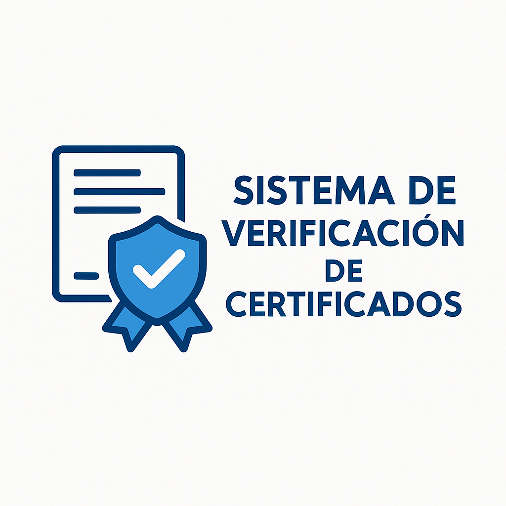

# QA Santo Tomás - Plataforma de Certificados Digitales

<p align="center">
    
</p>

## Descripción
Plataforma web para la generación, gestión y validación de certificados digitales con código QR, desarrollada como proyecto académico por estudiantes de Ingeniería en Informática de Santo Tomás.

## Características principales
- Registro y autenticación de usuarios
- Generación de certificados digitales únicos
- Validación de certificados mediante QR o código manual
- Panel de usuario para gestión y revocación de certificados
- Seguridad y trazabilidad
- Manual de usuario y FAQ integrados

## Demo
Puedes ver una demo en: [https://qa.gasfiteriaintegralfyg.cl](https://qa.gasfiteriaintegralfyg.cl)

## Instalación
1. Clona el repositorio:
   ```bash
   git clone https://github.com/Nachoob/qa-santotomas.git
   cd qa-santotomas
   ```
2. Instala dependencias:
   ```bash
   composer install
   npm install && npm run build
   ```
3. Copia el archivo `.env.example` a `.env` y configura tus variables:
   ```bash
   cp .env.example .env
   php artisan key:generate
   ```
4. Configura la base de datos y ejecuta migraciones:
   ```bash
   php artisan migrate --seed
   ```
5. Inicia el servidor:
   ```bash
   php artisan serve
   ```

## Uso rápido
- Regístrate y accede a tu panel.
- Genera certificados y compártelos con QR.
- Valida certificados desde la página principal.

## Manual de usuario
Consulta el [Manual de Usuario](docs/USER_MANUAL.md) para una guía completa paso a paso.

## Créditos y equipo
Proyecto desarrollado por estudiantes de Ingeniería en Informática, Santo Tomás.

- Ignacio Balbontín
- Hector Mora
- Nicolas Burdiles
- Christopher Muñoz
- Cristian Tapia

## Licencia
Este proyecto es de uso académico y está bajo la licencia MIT.

## Contacto
¿Dudas o sugerencias? Escríbenos a: [soporte@santotomas.cl](mailto:soporte@santotomas.cl)
